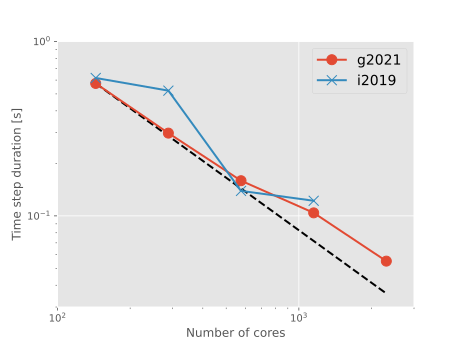

# Library and compiler comparison

## Scaling tests on Cartesius

Here we present the results of some simple scaling tests using different software stacks on the Dutch national supercomputer Cartesius.
These tests were performed in anticipation of the migration to a new national supercomputer called Snellius.
The test case is that of Rayleigh-Benard convection in a cube at a resolution of $384^3$.
The multi-resolution technique is turned off for this example.

### Snellius software stacks
On Cartesius, there are currently three module environments from which software toolchains can be loaded: `2020`, `2019`, and `pre2019`.
On the new HPC Snellius, these will be replaced by a new `2021` software stack, which has been made available to preview on Cartesius.
Importantly, SURFsara have stated their intention to use a GNU-based toolchain (`foss`) as the main stack on which other modules will be based.
As things stand, the FFTW library required by AFiD is only provided in the `2021` environment in the GNU toolchain.
Therefore AFiD *cannot* be compiled in the `2021` environment using an Intel software stack.
Below, we test this software stack for its performance relative to the previously reliable `intel/2018b` from the `2019` environment.

To begin, we compare four software stacks outlined in the table below based on the wall-time per time step for the example on 576 cores (or 24 nodes).
For information on the relevant compiler flags, check the [Makefile](https://github.com/chowland/AFiD-MuRPhFi/blob/main/Makefile).
The Intel toolchains were compiled with `MACHINE=CARTESIUS` whereas the GNU toolchains were compiled using `MACHINE=SNELLIUS`.

Stack name | `module load` command                             | Time step duration
:--------: | :-----------------------------------------------: | :----------------:
i2019      | `2019 intel/2018b HDF5 FFTW`                      | 0.180s
i2020      | `2020 intel/2020a HDF5 FFTW/3.3.8-intel-2020a`    | 0.254s
g2020      | `2020 foss HDF5/1.12.0-gompi-2020a`               | 0.182s
g2021      | `2021 foss HDF5/1.10.7-gompi-2021a`               | 0.154s

**Note:** SURFsara are [aware of an issue](https://servicedesk.surfsara.nl/wiki/pages/viewpage.action?pageId=19825049) on Cartesius with the performance of FFTW in the i2020 software stack.
This most likely explains the slowdown in the table for the i2020 results, and why SURFsara have not (yet) ported an Intel-compiled version of FFTW to the `2021` environment.

Still, it is reassuring that the new `2021` software stack performs so well.
Below we take this comparison further, and perform scaling tests using the i2019 and g2021 software stacks.

{ width=100% }

The Intel software stack seems rather wild in its scaling behaviour compared to the GNU toolchain.
On 576 cores we find a faster performance than in the previous run (0.139s vs 0.180s), but poor scaling on 1152 cores and the program simply hangs at 2304 cores.
By comparison the scaling of the GNU toolchain remains good up to 2304 cores.
Some of this variation in scaling may arise from the extreme optimisation flag `-O3` used for compilation with the Intel toolchain.
AFiD only compiles with `-O2` or less when using the GNU toolchain, so this may provide some difference between the two cases.

More tests are needed to understand the variation in the scaling behaviour and its potential dependence on the compiler flags.
But for now, it seems that performance will remain satisfactory with the GNU toolchain on Snellius.