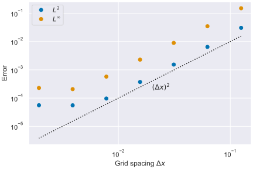
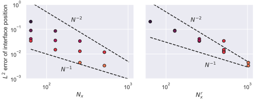

# Convergence tests

## 1-D pure diffusion
Here we consider the evolution of the temperature field in 1-D in the absence of advection.
The temperature satisfies the equation

$$
\partial_t T = \kappa \partial_{xx} T ,
$$

where $\kappa = (RaPr)^{-1/2}$ is the dimensionless diffusivity prescribed by the input parameters.
For homogeneous boundary conditions on the domain $[0,1]$ we can derive the separable solutions

$$
T = T_n e^{-\kappa \lambda_n^2 t} \sin (\lambda_n x)
$$

for wavelengths $\lambda_n = 2\pi n$ and arbitrary constants $T_n$.
Since the governing equation is linear we can add such solutions together, and also simply add them to a linear conductive profile if we want to satisfy non-zero boundary conditions.

As a convergence test, we consider the case of $T_1=1$ and $T_3=1$ added to a linear profile satisfying the boundary conditions $T=\pm 0.5$, and set the diffusivity to $\kappa=0.01$.
The time step is fixed at $\Delta t = 10^{-5}$.
Varying the number of grid points from 8 to 1024, we find second order convergence in both the $L^2$ and $L^\infty$ norms of the temperature error, defined as

$$
L^2 = \sqrt{\frac{1}{t_f}\int_0^{t_f} \int_0^1 (T - T_a)^2 \, \mathrm{d}x \, \mathrm{d}t}, \qquad L^\infty = \max_{x,t} |T - T_a|
$$

where $T$ is the simulation output, $T_a$ is the analytic solution, and $t_f=1$ is the end time of the simulation.

{ width="100%" }

<!-- <figure markdown>
  { width="100%" }
  <figcaption markdown>$L^2$ and $L^\infty$ errors of the temperature field as a function of the grid spacing.
  </figcaption>
</figure> -->

<!-- ## 2-D Taylor-Green vortex
**To be completed**

To test the convergence of the combined advection and diffusion, we consider the velocity field associated with a decaying, advected Taylor-Green vortex.
Since this vortex relies on periodic boundary conditions, we consider the flow to be two-dimensional in the $yz$-plane, with the boundary conditions at $x=0$ and $x=1$ being free-slip to allow for uniformity in the $x$-direction.
The analytic form of the velocity field is

$$
v = -\sin(z-Wt)\cos(y) e^{-2\nu t}, \qquad w = W + \cos(z - Wt)\sin(y) e^{-2\nu t} ,
$$

where $W$ is a uniform constant advection, and $\nu=(Pr/Ra)^{1/2}$ is the dimensionless viscosity (or inverse Reynolds number) determined by the input parameters $Ra$ and $Pr$. -->

## Phase-field model: 1-D Stefan problem

Now we perform a convergence test for the phase-field model used to simulate liquid-solid phase transitions.
We consider the problem of a liquid phase freezes from a cold boundary and a solidification front moves across the domain.
As for the melting problem on the [validation page](phasefield_validation.md), the analytic solution for the phase boundary height is

$$
h(t) = 2\Lambda \sqrt{(t+t_0)/Pe_T} ,
$$

where $\Lambda = 0.62$ for $\mathcal{S}=1$, and $t_0$ is a value such that $h(0)=0.1$.
Following the results on the validation page, we perform these tests with phase-field coupling parameter fixed at $A=100$.
We vary the size of the base grid `nxm` between 64 and 512, and vary the size of the refined grid `nxmr` between 64 and 1024.
We calculate the $L^2$ error of the interface position $h$ and plot it below.
The $L^2$ error is predominantly controlled by the resolution of the refined grid, showing a convergence between first and second order.

<figure markdown>
  { width="100%" }
  <figcaption markdown>$L^2$ error of the interface position as a function of resolution. The left panel shows trends with the resolution of the base grid `nxm`, whereas the right panel shows the convergence with the refined grid resolution `nxmr`.
  </figcaption>
</figure>

The results highlight the importance of high resolution for the phase-field variable.
Even for the lowest base resolution of $N_x=64$, we find that the phase-field model tracks the interface reasonably accurately if the refined grid is sufficiently large, say $N_x^r=512$.
However, as seen in the below plot of the interface position with time, such a disparity between the resolutions results in some oscillations in the interface position due to the coupling between $\phi$ and the temperature field.
Such oscillations only appear significant when the refined grid is more than twice as fine as the base grid.

 


Inspection of the temperature profiles shows a similar trend, where under-resolution of the phase-field can lead to excessive diffusion at the phase boundary, and significant deviations from the melting temperature in the solid phase close to the interface.



## Phase-field model: 2-D Melting Rayleigh-Bénard Convection

We follow [Favier et al. (2019)](https://doi.org/10.1017/jfm.2018.773) in performing a convergence study, now taking into account the resolutions of the two grids separately.
The following plot presents the height of the phase boundary $\phi=0.5$ at the time $t=0.1 Pe$ for a range of resolutions.



As in the previous cases, we see that the resolution of the phase field is most important for the accurate evolution of the phase boundary.
This highlights a key advantage of our multiple-resolution technique, where only the phase-field variable needs evolving on the largest grid.
The above figure presents results for the model parameter $A=10$.
[Favier et al. (2019)](https://doi.org/10.1017/jfm.2018.773) found that the interface rose vertically as they increased the resolution of their simulation, whereas we do not observe such a monotonic trend.
This is likely due to the different implementations of the phase-field method between that paper and that used here.
