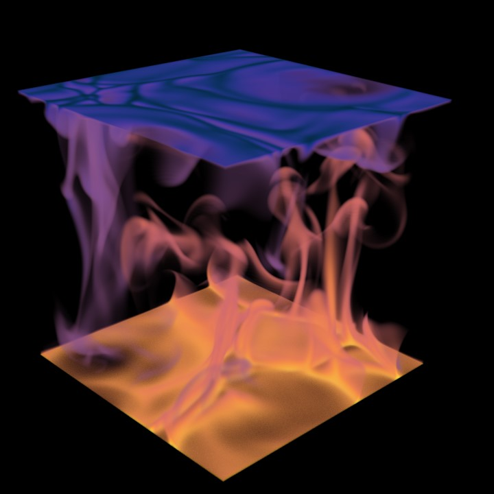

# Rayleigh-Bénard Convection

One of the simplest setups we can consider is the Rayleigh-Bénard problem, where fluid is contained between two stationary parallel plates which are held at fixed temperatures.
If the lower plate is maintained at a higher temperature than the upper plate, then density differences due to temperature can drive convection in the domain.
Stronger thermal driving, characterised by a larger Rayleigh number, drives a stronger flow.

In MuRPhFi, we can take advantage of the multiple resolution grid to efficiently simulate this problem at high $Pr$.
Since `temp` on the coarse grid and `sal` on the refined grid evolve according to the same equations (up to a different $Pr$), we can treat `sal` as $-\theta/\Delta$ for the dimensionless temperature of the system.
We set `activeT=0` to remove the effect of `temp` on the buoyancy and run the simulation.

## 2D Visualization

Here, we show the results for $Ra=10^8$, $Pr=10$.
The simulation was run with a resolution of $128^3$ on the coarse grid for velocity, and a resolution of $384^3$ on the refined grid for "temperature".
First, we use the script `parallel_movie.py` to produce a visualisation of a vertical slice of the "temperature" field `sal`:

<video width="100%" controls>
  <source src="../../assets/RBC.mp4" type="video/mp4">
</video>

## Statistics

We can then dive into the statistics output in `means.h5` to calculate the dimensionless heat flux due to the convection, the Nusselt number $Nu$, and the Reynolds number $Re$.
The following are produced from the script `plot_time_series.py`.

## Nusselt number

In Rayleigh-Bénard convection, there are a number of ways to calculate the Nusselt number, all of which should be equivalent (in a time-averaged sense) in a well-resolved, statistically steady state.
Firstly, we can measure the conductive heat flux at the top and bottom plates:

$$
{Nu}_\mathrm{pl} = \frac{H}{\Delta} \left.\frac{\partial \theta}{\partial z} \right|_{z=0}, \qquad Nu_\mathrm{pu} = \frac{H}{\Delta} \left.\frac{\partial \theta}{\partial z} \right|_{z=H}
$$

The volume average of the heat flux will give us another definition, computed as the sum of conductive and convective contributions:

$$
Nu_\mathrm{vol} = 1 + \frac{\langle w'\theta'\rangle}{\kappa \Delta/H}
$$

Substituting this into the equations for kinetic energy $\langle|\boldsymbol{u}|^2\rangle$ and temperature variance $\langle\theta^2\rangle$ provide two further definitions, linked to the volume-averaged dissipation rates:

$$
Nu_\varepsilon = 1 + \langle \partial_i u_j \partial_i u_j \rangle / (U_f/H)^2, \qquad
Nu_\chi = \langle |\nabla \theta|^2 \rangle / (\Delta/H)^2 .
$$

{ width="100%" }

### Reynolds number

Since there is no imposed flow and no volume-averaged mean flow in Rayleigh-Bénard convection, we use the volume-averaged kinetic energy $\mathcal{K}$ to compute a Reynolds number.
With this approach, we can also separately compute Reynolds numbers based on the vertical kinetic energy $\langle w^2\rangle$ and on the horizontal kinetic energy $\langle u^2 + v^2\rangle$.

As in the Nusselt number plot above, we appear to converge to a statistically steady state for $t \geq 75 H/U_f$ after the initial transient behaviour.

{ width="100%" }

## 3D Visualization

Finally, we can use the saved 3D snapshots to make a volume rendering of the temperature field.
This snapshot highlights the narrow plume structures driving the large-scale circulation at high $Pr$.
The image has been produced using ParaView.

{ width="100%" }