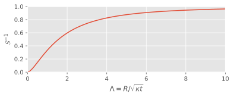

# Phase-field model validation

## 1-D Freezing from a cold boundary

First, we shall validate the phase-field implementation against the classical textbook example of a growing solidifaction front such as that presented in [Davis (2001)](https://doi.org/10.1017/CBO9780511546747).
This example does not involve any fluid flow, so the dynamics are entirely determined by the 1-D diffusion equation for temperature

$$
\partial_t T =\frac{1}{Pe}\partial_{xx} T,
$$

and the boundary conditions.
The initial condition considers an isothermal fluid at the melting temperature $T_m$, which in our dimensionless framework we can set to $T=1$.
At $t=0$, the lower boundary at $x=0$ is set to a lower temperature $T=0$, and the fluid begins to solidify from the bottom.
At the moving solidification front $h(t)$, the boundary conditions are

$$
T = T_m = 1, \qquad \mathcal{S}\frac{dh}{dt} = \frac{1}{Pe}\frac{\partial T}{\partial x} ,
$$

where $\mathcal{S}$ is the Stefan number.
Using the similarity variable $\eta = \frac{x}{2\sqrt{t/Pe}}$, this problem can be solved analytically as

$$
T(x,t) = \frac{\mathrm{erf}(\eta)}{\mathrm{erf}(\Lambda)} \quad \textrm{for} \quad 0<x<h(t), \qquad h(t) = 2\Lambda \sqrt{t/Pe} ,
$$

where $\Lambda$ depends on the Stefan number through the condition

$$
\sqrt{\pi}\Lambda e^{\Lambda^2} \mathrm{erf}(\Lambda) = \mathcal{S}^{-1} .
$$

When validating our numerical solver against this solution, it makes sense to avoid the singularity at $t=0$, so we can instead start the simulation when the solidification front is already a finite distance from the lower wall.
We take the initial position of the interface to be $x=0.1$, which corresponds to a start time of $t=Pe\left(\frac{h}{2\Lambda}\right)^2 = 0.0025 Pe/\Lambda^2$, and an initial condition for the simulation of

$$
T(x,t) = \frac{1}{\mathrm{erf}(\Lambda)} \mathrm{erf}\left(\frac{\Lambda x}{0.1}\right) \quad \textrm{for} \quad 0<x<0.1, \qquad T = 1 \quad \textrm{for} \quad x>0.1.
$$

### 1-D melting from a hot boundary
For a pure substance, i.e. one where melting and freezing solely depends on the temperature, the inverse problem is mathematically identical.
Therefore we can also validate against the case of an initially isothermal solid at the melting temperature $T=T_m = 0$ melting due to a boundary whose temperature is higher at $T=1$.
The above initial condition can be used by simply mapping $T \rightarrow 1 - T$.

## Radial growth of a solid disc in a supercooled liquid
This simple example is used by a number of recent studies to validate their Stefan problem solvers in 2-D, such as [Gibou and Fedkiw (2005)](https://doi.org/10.1016/j.jcp.2004.07.018), [Chen et al. (2009)](https://doi.org/10.1016/j.jcp.2009.04.044), and [Huang et al. (2021)](https://doi.org/10.1016/j.jcp.2021.110162).
These studies compare to the analytic solution presented in [Frank (1950)](https://doi.org/10.1098/rspa.1950.0080), but appear to use the solution for a growing 3-D sphere rather than a 2-D disc.
To avoid any ambiguity, we present the two-dimensional solution below.

We solve the radially symmetric diffusion equation in 2-D

$$
\frac{\partial T}{\partial t} = \kappa \frac{1}{r}\frac{\partial}{\partial r}\left(r\frac{\partial T}{\partial r} \right),
$$

in $r>R(t)$, where $R(t)$ is the radial position of the interface between the solid and the supercooled liquid.
Similar to the above 1-D examples, we can use a similarity variable $s=r/\sqrt{\kappa t}$ to reduce the equation to an ODE.
The partial derivatives can be then substituted as

$$
\frac{\partial}{\partial r} = \frac{1}{\sqrt{\kappa t}} \frac{d}{ds}, \qquad \frac{\partial}{\partial t} = \frac{-s}{2t} \frac{d}{ds} ,
$$

resulting in the governing equation

$$
T'' = -\left(\frac{s}{2} + \frac{1}{s}\right) T' .
$$

**Note:** This is where the key difference between 2-D and 3-D manifests itself. When using spherical symmetry, the governing equation reads $T''=-(s/2 + 2/s)T'$.

Integrating up the 2-D equation provides the solution

$$
T(r,t) = \frac{F(s)}{F(\Lambda)}, \qquad F(s) = \int_s^\infty \frac{e^{-z^2/4}}{z} dz ,
$$

where $\Lambda$ is the value of the similarity variable on the phase boundary, so $R(t) = \Lambda \sqrt{\kappa t}$.
Here we have taken the temperature in the solid disc, and thus the temperature at $R$ to be equal to the melting temperature $T=T_m=1$.
This neglects the Gibbs-Thomson effect, with us assuming that the effect of the surface curvature on the melting point is small.
The value of $\Lambda$ can be found by imposing the melt condition at the boundary:

$$
\mathcal{S}\frac{dR}{dt} = -\kappa \frac{\partial T}{\partial r} \quad \Rightarrow \quad \mathcal{S} \frac{\Lambda}{2} = -\frac{F'(\Lambda)}{F(\Lambda)} \quad \Rightarrow \quad \frac{\Lambda^2}{2} e^{\Lambda^2 / 4} F(\Lambda) = \mathcal{S}^{-1}
$$

The dependence of $\Lambda$ on the Stefan number $\mathcal{S}$ can be seen in the figure below.
{ width=100% }

For the validation example, we shall take $\mathcal{S}=10$ so that $\Lambda = 0.3692$.
We take the initial radius as 0.2, and the analytic form of the temperature field is that at time $t=(R/\Lambda)^2/\kappa$.