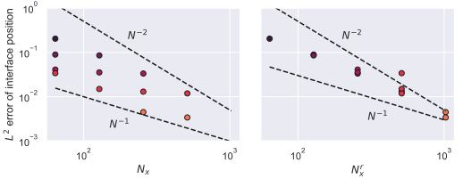

# Phase-field model validation

## 1-D melting from a hot boundary: phase-field parameters

We begin by investigating the model parameter $a$ introduced by the phase-field method.
As a reminder, the governing equation for the phase field $\phi$ takes the form

$$
\partial_t \phi = D \nabla^2 \phi - \frac{D}{\varepsilon^2} \phi (1 - \phi) (1 - 2\phi + A(T - T_m)) ,
$$

where $D=1.2/\mathcal{S}A Pe_T$ represents the diffusion coefficient of the phase field, and $S$ captures the strength of the coupling between the temperature field and the phase field.

<!-- Since the thermal coupling term in the above equation is premultiplied by $1/\varepsilon^2$, where $\varepsilon$ is equal to the refined grid spacing, its magnitude can become very large.
This can cause numerical instability of the phase-field equation if the time step is too large.
From testing the [1-D melting example](examples/stefan.md) for a range of values of $A$ and $C$, we find the following restrictions for the time step:

$A$  | $C$ | ${\Delta t}_\mathrm{max}$
:--: | :-: | :------------------------
1    | 1   | $10^{-3}$
1    | 10  | $2\times 10^{-4}$
1    | 100 | $2\times 10^{-5}$
0.1  | 1   | $10^{-2}$
0.1  | 10  | $2\times 10^{-3}$
0.1  | 100 | $2\times 10^{-4}$
0.01 | 1   | $10^{-1}$
0.01 | 10  | $2\times 10^{-2}$
0.01 | 100 | $2\times 10^{-3}$

These tests were all performed with $Pe_T=10^3$, with a base resolution of $N_x = 512$ and a refined grid resolution of $N_x^r = 1024$.
It is clear from these results that the prefactor $AC$ constrains the maximum possible time step.
Since the model requires that $AC=1.2 \mathcal{S}^{-1}$, we anticipate the time step restriction to be less severe at high Stefan number. -->

With that in mind, let us now consider how the value of $A$ affects the results produced by the phase-field method.
As a reminder, $A=\varepsilon H\Delta T/\Gamma$, where $\Gamma$ is related to the surface energy of the interface.
Larger values of $A$ therefore reduce the impact of the Gibbs-Thomson effect, where high local curvature increases the local melting temperature.
In our 1-D example, the value of $A$ should therefore play no significant effect.

First, we consider the position of the phase boundary over time.
The analytic solution for the phase boundary height is

$$
h(t) = 2\Lambda \sqrt{(t+t_0)/Pe_T} ,
$$

where $\Lambda = 0.62$ for $\mathcal{S}=1$, and $t_0$ is a value such that $h(0)=0.1$.
In the below figure, we plot the analytic solution against the position of $\phi=0.5$ for the phase-field model with $1\leq A \leq 100$.

 


As expected, the value of $A$ appears to have little impact on the phase-field solution.
Small differences between the simulations develop, but this is likely due to the initial condition of the phase-field, which is taken to be the equilibrium solution $\phi=0.5(1 - \tanh ((x-0.1)/2\varepsilon))$.
This initial condition may not perfectly represent the initial motion of the interface at early times.

Now we can take a closer look at the temperature profiles as we vary the parameters.
Below we plot the temperature profile $T(x,t)$ for a range of discrete times between $t=0$ and $t=100$.



The results at first seem almost indistinguishable from the analytic solution for each value of $A$.
However on close inspection, we can see that the temperature in the solid phase near the phase boundary is slightly above the melting temperature $T=0$ for the cases $A>1$.
This does not appear to play a significant role in the development of the temperature field in the liquid, or the interface position, but this result should be kept in mind when proceeding with the other validation cases.

## 1-D Freezing from a cold boundary: resolution study

Now we have a good idea of how the model parameters behave, we perform a convergence study to investigate how the accuracy of the simulation depends on the resolution, both of the base grid and the refined grid.
We consider the inverse problem to that above, where a liquid phase freezes from a cold boundary and a solidification front moves across the domain.
Thanks to the symmetry with the previous problem, the position of the phase boundary should be unchanged from that above.
Following the above results, we perform these tests with phase-field parameter fixed at $A=100$.
We vary the size of the base grid `nxm` between 64 and 512, and vary the size of the refined grid `nxmr` between 64 and 1024.



The results highlight the importance of high resolution for the phase-field variable.
Even for the lowest base resolution of $N_x=64$, we find that the phase-field model tracks the interface reasonably accurately if the refined grid is sufficiently large, say $N_x^r=512$.
Such a disparity between the resolutions does however result in some oscillations in the interface position due to the coupling between $\phi$ and the temperature field.
Such oscillations only appear significant when the refined grid is more than twice as fine as the base grid.

Inspection of the temperature profiles shows a similar trend, where under-resolution of the phase-field can lead to excessive diffusion at the phase boundary, and significant deviations from the melting temperature.



For a more quantitative analysis, we plot the $L^2$ error of the interface position below.
As suggested by the above figures, the $L^2$ error is predominantly controlled by the resolution of the refined grid, showing a convergence between first and second order.

<figure markdown>
  { width="100%" }
  <figcaption markdown>$L^2$ error of the interface position as a function of resolution. The left panel shows trends with the resolution of the base grid, whereas the right panel shows the convergence with the refined grid resolution.
  </figcaption>
</figure>

## 1-D Freezing of a supercooled melt

As we shall see, the stability of the phase-field model is more sensitive to the parameter choices for the case of supercooling.
In this example, the solid phase grows out of a liquid that is cooled to below the melting temperature.
An analytic solution can be derived for a semi-infinite domain, which we can compare to our finite domain when the interface is sufficiently far from the upper boundary.

For $A = 1$ the one-dimensional growth of the solid phase matches the analytic solution well, even as the effect of the upper boundary becomes more significant.
As seen below, both the temperature profiles and the interface position are consistent with the analytic solution.





However, for higher values of $A$ the model breaks down, and the phase field $\phi$ takes begins to take values away from $0$ and $1$ in the liquid layer.
The heat fluxes also appear inconsistent at the phase boundary, with relatively large temperatures spreading throughout the domain.



The reason for the instability of the system is currently unclear, but given these results, it seems sensible to fix the model parameter $A=1$ in simulations where the effect of supercooling may occur.

## 2-D axisymmetric melting

We now consider our first two-dimensional problem, where curved phase boundaries arise and so changing the parameter $A$ will affect the results through the Gibbs-Thomson effect.
In particular, we follow the example from appendix A.2 of [Favier et al. (2019)](https://doi.org/10.1017/jfm.2018.773), where a disc of initial radius $r=0.1$ melts into a liquid of initially uniform temperature.
A video showcasing the evolution of the temperature field is shown below.

<video width="100%" controls>
  <source src="../assets/AxisymMelting.mp4" type="video/mp4">
</video>

[Favier et al. (2019)](https://doi.org/10.1017/jfm.2018.773) provide a semi-analytic solution for the case in which surface energy is zero and the melting temperature on the phase boundary remains equal to $T_m$.
Below, we reproduce the two figures from their appendix.
We compare the phase-field model for various values of $A$, keeping $\mathcal{S}=1$.



The initial development is quite similar in all cases, since the curvature of the interface is not too high.
As the simulation develops and the disc shrinks, the interface curvature increases, leading to faster melting in the cases where $A$ is smaller.
This matches the trend seen by [Favier et al. (2019)](https://doi.org/10.1017/jfm.2018.773), and as $A$ gets larger, we appear to approach the semi-analytic solution associated with no Gibbs-Thomson effect.



This trend is even clearer in the temperature profiles, where for cases with lower $A$ we see the interface temperature drop significantly as the disc melts.
Reassuringly, despite such variation in the solid and phase boundary, the temperature profile in the liquid phase remains very similar between all cases.

## 2-D Rayleigh-Bénard convection with a melting boundary

Now, we introduce an example where the evolution of the temperature field and the phase boundary are also coupled to the fluid flow.
This again follows a validation example used by [Favier et al. (2019)](https://doi.org/10.1017/jfm.2018.773), and details of the initial condition can be found on the [examples page](examples/coupled_flows.md).
The system consists of a fluid heated from below that underlies a solid phase.
The evolution of the system is shown in the following video:

<video width="100%" controls>
  <source src="../assets/MeltingRBC.mp4" type="video/mp4">
</video>

We follow [Favier et al. (2019)](https://doi.org/10.1017/jfm.2018.773) in performing a convergence study, now taking into account the resolutions of the two grids separately.
The following plot presents the height of the phase boundary $\phi=0.5$ at the time $t=0.1 Pe$ for a range of resolutions.



As in the previous cases, we see that the resolution of the phase field is most important for the accurate evolution of the phase boundary.
This highlights a key advantage of our multiple-resolution technique, where only the phase-field variable needs evolving on the largest grid.
The above figure presents results for the model parameters $A=0.01$, $C=100$.
[Favier et al. (2019)](https://doi.org/10.1017/jfm.2018.773) found that the interface rose vertically as they increased the resolution of their simulation, whereas we do not observe such a monotonic trend.
This is likely due to the different implementations of the phase-field method between that paper and that used here.

Finally, we vary the model parameter $C$ to see the effect on the results.
Below, we vary the value of $C$ while keeping $AC=1.2$ fixed, with a resolution of $n_x=512$, $n_x^r=1024$.
As may be expected, the corners that emerge in the interface for $C=10^3$ are somewhat smoothed out by setting $C$ to a lower value.
This highlights the importance of choosing $C$ based on realistic values of the surface energy for each simulation.



## Axisymmetric growth from a supercooled melt

Finally, we investigate the problem of a solid disc that grows in a supercooled liquid.
In the absence of the Gibbs-Thomson effect, there is an analytic solution to this problem in an unbounded domain, as detailed on the [examples page](examples/stefan.md#2-d-axisymmetric-growth-of-a-disc-from-a-supercooled-melt) for Stefan problems.
We must consider this example in a confined domain, with periodic boundaries in $y$, and solid boundaries at $x=0$ and $x=1$.
In this example, we use Neumann (no flux) boundary conditions for the temperature at the solid walls.

As in the 1-D case with a supercooled melt, setting $C=1$ is necessary for an accurate simulation.
Tests with $C$ at higher values again showed spurious behaviour in the temperature and phase field.
We perform the validation simulation for this example at a resolution of $512^2$ for the base (temperature) grid, and $1024^2$ for the refined (phase-field) grid.
The development of the temperature field and the phase boundary are shown in the below video:

<video width="100%" controls>
  <source src="../assets/disc_growth_ice.mp4" type="video/mp4">
</video>

Towards the end of the simulation, we see that the disc shape deviates somewhat from axisymmetry due to the effect of the boundary conditions.
Nevertheless, we can use the early evolution of the system for validation of the phase-field model.
Below, we plot the disc radius as a function of time.
The radius is estimated by integrating the phase-field $\phi$ to find the area covered by the solid, and then assuming that the disc remains circular:

$$
r(t) = \sqrt{\frac{\int_\mathcal{D} \phi \,\mathrm{d}A}{\pi}}
$$



The agreement between the phase-field model and the unbounded solution is reassuringly good, despite the clear impact of the boundaries at later times.
Setting $C=1$ does not appear to introduce a significant Gibbs-Thomson effect to the solidification dynamics.
Indeed for this case we can exactly quantify the magnitude of this effect since the mean curvature is simply $K=1/R$ for a given disc radius.
In our dimensionless framework, the melting temperature is modified such that the temperature at the phase boundary is

$$
T_b = T_m + \frac{\varepsilon}{C} K ,
$$

so for $\varepsilon \approx 10^{-3}$ and $K\leq 10$, the melting temperature is only modified by at most 0.01.

Below, we plot the radial temperature profiles over time in the simulation.
The initial agreement is very good, although the insulating boundary conditions cause the temperatures at the outer boundaries to increase over time beyond that of the unbounded analytic solution.
Nevertheless, the gradients close to the phase boundary remain consistent with the exact solution even at these later times.



## Next on the validation list

As things stand, we are happy with the validation of the phase-field code, particularly for standard melting and freezing dynamics.
Before starting any new projects that involve simulating supercooled liquids or multicomponent problems (where temperature and salinity affect the phase transition), we should run further validation cases:

- Mullins-Sekerka instability
    - quantitative predicitons from growing planar front
    - qualitative dynamics of dendritic growth from a perturbed disc
- Double-diffusive melting dynamics
    - [Martin & Kauffman (1977)](https://doi.org/10.1175/1520-0485(1977)007<0272:AEATSO>2.0.CO;2) diffusive example?
    - Perhaps the Davis textbook has more examples for this including morphodynamic instability?