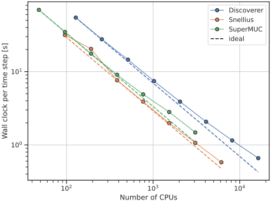
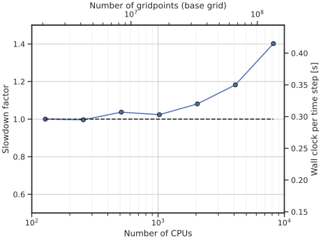

# Scaling performance

## Strong scaling
(performed October 2023)

Here we present the results of a strong scaling test run across various European supercomputers.
The test case is that of Rayleigh-Benard convection with phase change in a cube.
The resolution of the base grid, on which the velocity and temperature fields are computed, is fixed to $768^3$.
The multiple-resolution technique is used for simulation using the phase-field, with a refined grid of $2304^3$.

{ width=100% }

Dashed lines in the above figure represent the ideal scaling, where doubling the number of CPUs halves the wall clock per time step.
The data reported here does not include any I/O or statistics calculations, only the duration of the time stepping procedure.
This information is printed to the simulation output as a line reading
`Minimum Iteration Time = ...`

**N.B.** The first two points of the Snellius data were obtained on high memory nodes, which are of slightly older architecture compared to the rest of the Snellius data (AMD Rome vs AMD Genoa).

## Weak scaling
(performed November 2023)

Here we present the results of a weak scaling test, where the number of gridpoints is increased correspondingly to the number of computational cores.
This test was performed on the [Discoverer HPC](https://docs.discoverer.bg/index.html).

As above, the test case is a simulation of melting Rayleigh-Bénard convection using the phase-field model on a high resolution grid.
The base case, performed on 1 node of 128 CPUs, had a resolution of $128^3$ for the velocity and temperature variables and a resolution 3 times greater in each direction for the phase-field.

For each doubling of the computational core count, the number of grid points in one of the periodic directions (`y` or `z`) is also doubled.

{ width=100% }