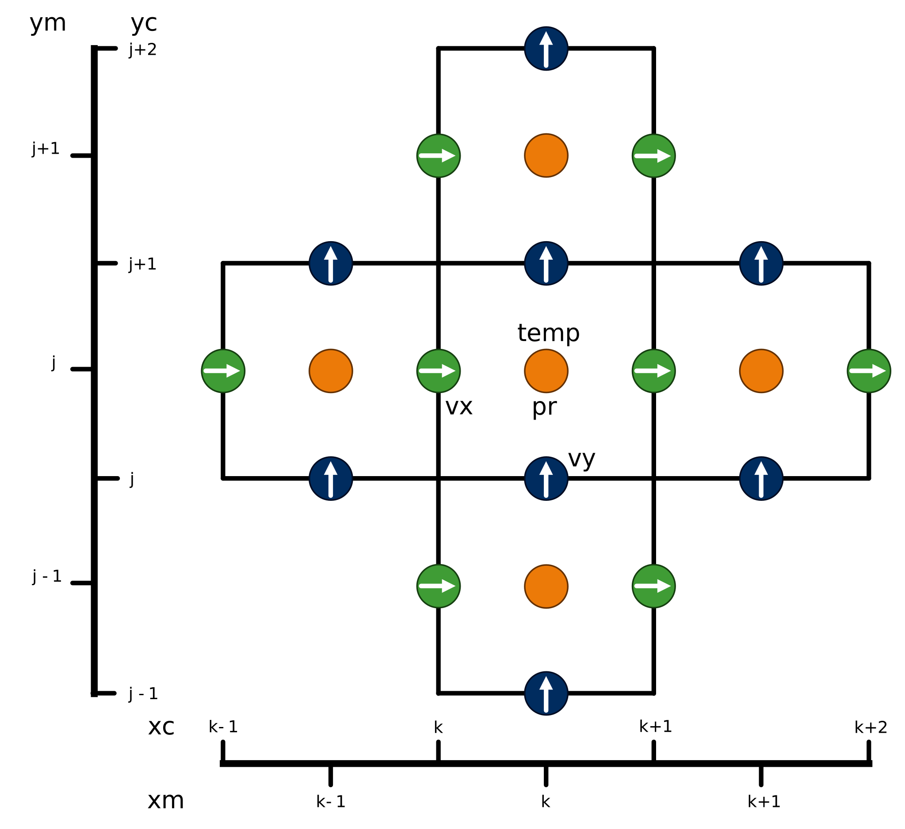

# Spatial derivatives

## Staggered grid layout

To avoid the development of spurious modes in the pressure solve, the velocity field is housed on a staggered grid, as shown in the above schematic.
The pressure field `pr` is stored at the cell midpoints, on the grid defined by the coordinates (`xm(k)`, `ym(j)`, `zm(i)`).
We also store the temperature field `temp` (and if used the humidity field `qhum`) at the cell midpoints.
The velocity components are then discretised on their corresponding cell edges.

The boundaries of the domain are specified to lie on the grid of the cell edges, so for example (if the x-domain size is set as `alx3=1`)

$$
x_c[1] = 0, \qquad x_c[n_x] = 1 .
$$

The cell mid-points are always defined as

$$
x_m[k] = \frac{x_c[k] + x_c[k+1]}{2} ,
$$

whether the grid is stretched or uniform.
The grids in $y$ and $z$ must always be uniformly spaced so that Fourier transforms can be performed in the pressure solver, but the grids in $x$ can be non-uniform.
Their stretching is defined by the input parameters `str3` and `istr3`.

## Finite difference method on non-uniform grids

In the case of a uniform grid of grid spacing $\Delta x$, it is straightforward to obtain a finite-difference expression for the second derivative of a function $f(x)$ accurate to second order in $\Delta x$:

$$
f''(x_k) \approx \frac{f_{k+1}-2f_k + f_{k-1}}{ {\Delta x}^2} + O({\Delta x}^2).
$$

Here we have written $f_k=f(x_k)$ for values of the function on the discrete grid $x_k=k\Delta x$.

When using a stretched grid, as we do in AFiD to resolve thin boundary layers, the spacing between grid points is non-uniform, and we must modify this expression.
By Taylor expanding $f(x)$ about $x_k$, we obtain the following expression for the second derivative:

$$
f''(x_k) = \frac{2}{\delta_+ + \delta_-} \left[\frac{f_{k+1}-f_k}{\delta_+} - \frac{f_k - f_{k-1}}{\delta_-} \right] ,
$$

where $\delta_+=x_{k+1}-x_k$ and $\delta_- = x_k - x_{k-1}$ are the grid spacings either side of $x_k$.
Note that if $\delta_+=\delta_-$, we recover the previous expression used for a uniform grid.
This expression is used by the subroutine `second_derivative_coeff` to generate the relevant difference coefficients for each variable.

### Boundary conditions
The boundary points need to be treated with care in the code, since the second derivative is the only term in which the boundary values are specified in the numerics.
The expression for the derivative is essentially unchanged, except that at for example the lower boundary we must introduce a "ghost point" $x_0=-x_1$.
We then determine the value of $f$ at this ghost point based on the type of boundary condition imposed:

$$
f_0 = 2a - f_1 \quad \textrm{if} \quad f(0) = a, \qquad \qquad
f_0 = f_1 \quad \textrm{if} \quad f'(0) = 0 .
$$

We determine the nature of the boundary conditions via the variables `inslws/n` (for $v,w$), `TfixS/N` (for $T$), and `SfixS/N` (for $S$) from the input file `bou.in`.
Note that $u=0$ and $\partial_x \phi=0$ are always imposed.
Currently, the values of the boundary conditions for $T$ and $S$ are hard-coded in `SetTempBCs` and `SetSalBCs`.
This may want to be changed in the future to allow more control from the input file.
Note that the boundary values are added to the derivative expression directly in the subroutines `ImplicitAndUpdateXX`.